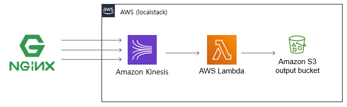

# centralized-logging-pipeline
AWS에 배포된 웹서버(nginx)를 대상으로 중앙화된 로깅 파이프라인(Centralized Logging Pipeline) 구축
(with Kinesis data stream + Lambda + S3)

* 목차
  * [구조](#구조)
  * [centralized-logging-pipeline 구성 절차](#centralized-logging-pipeline-구성-절차)
    * [Requires](#requires)
    * [테스트 환경](#테스트-환경)
    * [구성 절차](#구성-절차)
  * [개념 검증(PoC) 수행 내용](#개념-검증poc-수행-내용)
    * [using python code (unittest)](#using-python-code-unittest)
    * [nginx + td agent](#nginx--td-agent)
---

# 구조

* nginx 의 Access log 를 1분 주기로 Kinesis data stream (logging-stream) 으로 전송합니다.
  * nginx Access log format
```text
### example
1.1.1.1 - - [19/Apr/2020:04:07:59 +0000] "GET / HTTP/1.1" 200 3184 "-" "Mozilla/5.0 (Windows NT 10.0; Win64; x64) AppleWebKit/537.36 (KHTML, like Gecko) Chrome/81.0.4044.113 Safari/537.36"
2.2.2.2 - - [19/Apr/2020:04:08:00 +0000] "GET / HTTP/1.1" 302 4184 "-" "Mozilla/5.0 (Windows NT 6.1; WOW64; Trident/7.0; rv:11.0) like Gecko"
3.3.3.3 - - [19/Apr/2020:04:08:01 +0000] "GET /common/js/bootstrap.min.js HTTP/1.1" 200 5569 "http://183.111.252.151/main" "Mozilla/5.0 (Windows NT 10.0; Win64; x64) AppleWebKit/537.36 (KHTML, like Gecko) Chrome/81.0.4044.113 Safari/537.36"
4.4.4.4 - - [19/Apr/2020:04:08:00 +0000] "POST / HTTP/1.1" 404 3184 "-" "Mozilla/5.0 (Windows NT 6.1; WOW64; Trident/7.0; rv:11.0) like Gecko"
```

  * Kinesis record format
```jsonc
### example
[
    {
        "PartitionKey": "1",
        "Data": '{"message":"1.1.1.1 - - [19/Apr/2020:04:07:59 +0000] \\"GET / HTTP/1.1\\" 200 3184 \\"-\\" \\"Mozilla/5.0 (Windows NT 10.0; Win64; x64) AppleWebKit/537.36 (KHTML, like Gecko) Chrome/81.0.4044.113 Safari/537.36\\""}'
    },
    {
        "PartitionKey": "2",
        "Data": '{"message":"2.2.2.2 - - [19/Apr/2020:04:08:00 +0000] \\"GET / HTTP/1.1\\" 200 3184 \\"-\\" \\"Mozilla/5.0 (Windows NT 6.1; WOW64; Trident/7.0; rv:11.0) like Gecko\\""}'
    },
    {
        "PartitionKey": "3",
        "Data": '{"message":"3.3.3.3 - - [19/Apr/2020:04:08:01 +0000] \\"GET /common/js/bootstrap.min.js HTTP/1.1\\" 200 5569 \\"http://183.111.252.151/main\\" \\"Mozilla/5.0 (Windows NT 10.0; Win64; x64) AppleWebKit/537.36 (KHTML, like Gecko) Chrome/81.0.4044.113 Safari/537.36\\""}'
    },
    {
        "PartitionKey": "4",
        "Data": '{"message":"4.4.4.4 - - [19/Apr/2020:04:08:00 +0000] \\"POST / HTTP/1.1\\" 404 3184 \\"-\\" \\"Mozilla/5.0 (Windows NT 6.1; WOW64; Trident/7.0; rv:11.0) like Gecko\\""}'
    }
]
```
  
* Lambda (accessLogParser) 는 Kinesis data stream (logging-stream) event 를 받아 JSON 형식으로 변환합니다.
  * 변환한 JSON format
```jsonc
[
  {
    "remote": "1.1.1.1",
    "host": "-",
    "user": "-",
    "datetime": "19/Apr/2020:04:07:59 +0000",
    "method": "GET",
    "path": "/ ",
    "code": "200",
    "size": "3184",
    "agent": "Mozilla/5.0 (Windows NT 10.0; Win64; x64) AppleWebKit/537.36 (KHTML, like Gecko) Chrome/81.0.4044.113 Safari/537.36"
  },
  {
    "remote": "2.2.2.2",
    "host": "-",
    "user": "-",
    "datetime": "19/Apr/2020:04:08:00 +0000",
    "method": "GET",
    "path": "/ ",
    "code": "200",
    "size": "3184",
    "agent": "Mozilla/5.0 (Windows NT 6.1; WOW64; Trident/7.0; rv:11.0) like Gecko"
  },
  {
    "remote": "3.3.3.3",
    "host": "-",
    "user": "-",
    "datetime": "19/Apr/2020:04:08:01 +0000",
    "method": "GET",
    "path": "/common/js/bootstrap.min.js ",
    "code": "200",
    "size": "5569",
    "agent": "Mozilla/5.0 (Windows NT 10.0; Win64; x64) AppleWebKit/537.36 (KHTML, like Gecko) Chrome/81.0.4044.113 Safari/537.36"
  },
  {
    "remote": "4.4.4.4",
    "host": "-",
    "user": "-",
    "datetime": "19/Apr/2020:04:08:00 +0000",
    "method": "POST",
    "path": "/ ",
    "code": "404",
    "size": "3184",
    "agent": "Mozilla/5.0 (Windows NT 6.1; WOW64; Trident/7.0; rv:11.0) like Gecko"
  }
]
```
* Lambda (accessLogParser) 는 JSON 형식의 accessLog 를 S3 bucket (central-log) 에 저장합니다.
  * S3 bucket name : `central-log`
  * S3 object name format : `access_log/year=%Y/month=%m/day=%d/access_log_%H%M%S.json.gz`


# centralized-logging-pipeline 구성 절차
## Requires
* python 3
* pip (python package manager)
* Docker
* Docker-compose
* localstack

## 테스트 환경
* CentOS Linux release 7.6.1810 (Core)
* Python 3.6.8
* pip: pip 9.0.3 from /usr/lib/python3.6/site-packages (python 3.6)
* Docker: docker-ce-19.03.8-3.el7.x86_64
* docker-compose version 1.25.4, build 8d51620a
* localstack 0.11.0.5

## 구성 절차
```bash
### 1. download github source and unzip
$ curl -L -o master.zip https://codeload.github.com/wynn1275/centralized-logging-pipeline/zip/master
$ unzip master.zip

### 2. start localstack
$ cd cd centralized-logging-pipeline-master/
$ docker-compose up -d

### 3. apply AWS infrastructure (terraform)
$ cd localstack-tf/
$ terraform init
$ terraform apply
```

# 개념 검증(PoC) 수행 내용
## using python code (unittest)
#### PoC 개요
* AWS sdk(boto3)을 사용하여 Kinesis data stream 으로 mock 레코드(nginx access log) 를 전송 (Kinesis put-object)
* Lambda 는 Kinesis 로부터 레코드를 읽어 JSON 으로 변환 후 S3 로 저장
* 수행 내용은 python unittest 의 assert 를 통해 검증

#### PoC 실행 방법
```bash
$ cd test/python/
$ python integration_test.py
```

#### 결과
```text
(venv) C:\workspace\centralized-logging-pipeline\test\python>python integration_test.py

> Kinesis put-object response:
{'FailedRecordCount': 0, 'Records': [{'SequenceNumber': '49606254206874690336508514649071166261323799696165044226', 'ShardId': 'shardId-000000000000'}, {'SequenceNumber': '49606254206874690336508514649072375187143414325339750402', 'ShardId': 'shardId-000
000000000'}, {'SequenceNumber': '49606254206874690336508514649073584112963028954514456578', 'ShardId': 'shardId-000000000000'}, {'SequenceNumber': '49606254206874690336508514649074793038782643583689162754', 'ShardId': 'shardId-000000000000'}], 'ResponseM
etadata': {'RequestId': '14bef5d0-82fc-11ea-8994-3391cb35269f', 'HTTPStatusCode': 200, 'HTTPHeaders': {'server': 'BaseHTTP/0.6 Python/3.8.2', 'date': 'Mon, 20 Apr 2020 11:42:58 GMT', 'x-amzn-requestid': '14bef5d0-82fc-11ea-8994-3391cb35269f', 'x-amz-id-2
': 'UYuM8cQ4BsM5CQ9oIBnxQr98sb/29/UQqU6w3e+PyhLGkyfUrnDSQ/Z+d+zMrki1Zc/ViIMQJQLbtrSjFaPaVOFboIdqVSJr', 'content-type': 'application/x-amz-json-1.1', 'content-length': '479', 'connection': 'close', 'access-control-allow-origin': '*', 'access-control-allow
-methods': 'HEAD,GET,PUT,POST,DELETE,OPTIONS,PATCH', 'access-control-allow-headers': 'authorization,content-type,content-md5,cache-control,x-amz-content-sha256,x-amz-date,x-amz-security-token,x-amz-user-agent,x-amz-target,x-amz-acl,x-amz-version-id,x-loc
alstack-target,x-amz-tagging', 'access-control-expose-headers': 'x-amz-version-id'}, 'RetryAttempts': 0}}

> Uploaded S3 - latest file object key: access_log/year=2020/month=04/day=20/access_log_114257.json.gz
> s3 content(L0): b'{"remote": "1.1.1.1", "host": "-", "user": "-", "datetime": "19/Apr/2020:04:07:59 +0000", "method": "GET", "path": "/ ", "code": "200", "size": "3184", "agent": "Mozilla/5.0 (Windows NT 10.0; Win64; x64) AppleWebKit/537.36 (KHTML, lik
e Gecko) Chrome/81.0.4044.113 Safari/537.36"}\n'
> s3 content(L1): b'{"remote": "2.2.2.2", "host": "-", "user": "-", "datetime": "19/Apr/2020:04:08:00 +0000", "method": "GET", "path": "/ ", "code": "200", "size": "3184", "agent": "Mozilla/5.0 (Windows NT 6.1; WOW64; Trident/7.0; rv:11.0) like Gecko"}\n
'
> s3 content(L2): b'{"remote": "3.3.3.3", "host": "-", "user": "-", "datetime": "19/Apr/2020:04:08:01 +0000", "method": "GET", "path": "/common/js/bootstrap.min.js ", "code": "200", "size": "5569", "agent": "Mozilla/5.0 (Windows NT 10.0; Win64; x64) Appl
eWebKit/537.36 (KHTML, like Gecko) Chrome/81.0.4044.113 Safari/537.36"}\n'
> s3 content(L3): b'{"remote": "4.4.4.4", "host": "-", "user": "-", "datetime": "19/Apr/2020:04:08:00 +0000", "method": "POST", "path": "/ ", "code": "404", "size": "3184", "agent": "Mozilla/5.0 (Windows NT 6.1; WOW64; Trident/7.0; rv:11.0) like Gecko"}\
n'
.
----------------------------------------------------------------------
Ran 1 test in 2.820s

OK


```

## nginx + td agent
#### PoC 개요
* nginx 가 설치된 서버에 td-agent (with aws-fluent-plugin-kinesis) 를 사용하여 Kinesis 로 access_log 를 전송
 
#### Requires
* Ruby 2.3.0+
* Fluentd 0.14.22+ (td-agent v3.1.0+)
* [aws-fluentd-plugin-kinesis](https://github.com/awslabs/aws-fluent-plugin-kinesis)

#### PoC 실행 방법
```bash
$ cd test/td-agent/

### td-agent start
$ bash run-td-agent.sh

### td-agent stop
$ bash stop-td-agent.sh
``` 

#### 결과
* nginx access_log
```bash
[root@jy1 td-agent]# tail -f  /home/apps/logs/nginx_access.log
112.168.224.198 - - [20/Apr/2020:11:35:47 +0000] "GET / HTTP/1.1" 200 3184 "-" "Mozilla/5.0 (Windows NT 10.0; Win64; x64) AppleWebKit/537.36 (KHTML, like Gecko) Chrome/8     1.0.4044.113 Safari/537.36"
185.2.196.196 - - [20/Apr/2020:11:35:49 +0000] "GET / HTTP/1.1" 200 3184 "-" "Mozilla/5.0 (Windows NT 6.1; WOW64; Trident/7.0; rv:11.0) like Gecko"
112.168.224.198 - - [20/Apr/2020:11:35:49 +0000] "GET /old/ HTTP/1.1" 200 5268 "http://183.111.252.151/" "Mozilla/5.0 (Windows NT 10.0; Win64; x64) AppleWebKit/537.36 (K     HTML, like Gecko) Chrome/81.0.4044.113 Safari/537.36"
112.168.224.198 - - [20/Apr/2020:11:35:54 +0000] "GET /asdf HTTP/1.1" 404 555 "-" "Mozilla/5.0 (Windows NT 10.0; Win64; x64) AppleWebKit/537.36 (KHTML, like Gecko) Chrom     e/81.0.4044.113 Safari/537.36"
112.168.224.198 - - [20/Apr/2020:11:35:57 +0000] "GET / HTTP/1.1" 200 3184 "http://183.111.252.151/old/" "Mozilla/5.0 (Windows NT 10.0; Win64; x64) AppleWebKit/537.36 (K     HTML, like Gecko) Chrome/81.0.4044.113 Safari/537.36"
112.168.224.198 - - [20/Apr/2020:11:35:59 +0000] "GET /old2/ HTTP/1.1" 200 867 "http://183.111.252.151/" "Mozilla/5.0 (Windows NT 10.0; Win64; x64) AppleWebKit/537.36 (K     HTML, like Gecko) Chrome/81.0.4044.113 Safari/537.36"
```
* Lambda console log
```bash
[root@jy3 localstack-tf]# aws --endpoint-url=http://localhost:4566 logs tail /aws/lambda/accessLogParser --follow
2020-04-20T11:36:48.647000+00:00 2020/04/20/[LATEST]d440aee8 {"remote": "112.168.224.198", "host": "-", "user": "-", "datetime": "20/Apr/2020:11:35:47 +0000", "method": "GET", "path": "/ ", "code": "200", "size": "3184", "agent": "Mozilla/5.0 (Windows NT 10.0; Win64; x64) AppleWebKit/537.36 (KHTML, like Gecko) Chrome/81.0.4044.113 Safari/537.36"}
2020-04-20T11:36:48.654000+00:00 2020/04/20/[LATEST]d440aee8 {"remote": "185.2.196.196", "host": "-", "user": "-", "datetime": "20/Apr/2020:11:35:49 +0000", "method": "GET", "path": "/ ", "code": "200", "size": "3184", "agent": "Mozilla/5.0 (Windows NT 6.1; WOW64; Trident/7.0; rv:11.0) like Gecko"}
2020-04-20T11:36:48.662000+00:00 2020/04/20/[LATEST]d440aee8 {"remote": "112.168.224.198", "host": "-", "user": "-", "datetime": "20/Apr/2020:11:35:49 +0000", "method": "GET", "path": "/old/ ", "code": "200", "size": "5268", "agent": "Mozilla/5.0 (Windows NT 10.0; Win64; x64) AppleWebKit/537.36 (KHTML, like Gecko) Chrome/81.0.4044.113 Safari/537.36"}
2020-04-20T11:36:48.669000+00:00 2020/04/20/[LATEST]d440aee8 {"remote": "112.168.224.198", "host": "-", "user": "-", "datetime": "20/Apr/2020:11:35:54 +0000", "method": "GET", "path": "/asdf ", "code": "404", "size": "555", "agent": "Mozilla/5.0 (Windows NT 10.0; Win64; x64) AppleWebKit/537.36 (KHTML, like Gecko) Chrome/81.0.4044.113 Safari/537.36"}
2020-04-20T11:36:48.677000+00:00 2020/04/20/[LATEST]d440aee8 {"remote": "112.168.224.198", "host": "-", "user": "-", "datetime": "20/Apr/2020:11:35:57 +0000", "method": "GET", "path": "/ ", "code": "200", "size": "3184", "agent": "Mozilla/5.0 (Windows NT 10.0; Win64; x64) AppleWebKit/537.36 (KHTML, like Gecko) Chrome/81.0.4044.113 Safari/537.36"}
2020-04-20T11:36:48.684000+00:00 2020/04/20/[LATEST]d440aee8 {"remote": "112.168.224.198", "host": "-", "user": "-", "datetime": "20/Apr/2020:11:35:59 +0000", "method": "GET", "path": "/old2/ ", "code": "200", "size": "867", "agent": "Mozilla/5.0 (Windows NT 10.0; Win64; x64) AppleWebKit/537.36 (KHTML, like Gecko) Chrome/81.0.4044.113 Safari/537.36"}
2020-04-20T11:36:48.699000+00:00 2020/04/20/[LATEST]d440aee8 {'ResponseMetadata': {'HTTPStatusCode': 200, 'HTTPHeaders': {'server': 'BaseHTTP/0.6 Python/3.8.2', 'date': 'Mon, 20 Apr 2020 11:36:48 GMT', 'etag': '"8701f253e09001a677a29ecbe37b4d8f"', 'last-modified': 'Mon, 20 Apr 2020 11:36:48 GMT', 'content-length': '0', 'content-type': 'text/html; charset=utf-8', 'access-control-allow-origin': '*', 'access-control-allow-methods': 'HEAD,GET,PUT,POST,DELETE,OPTIONS,PATCH', 'access-control-allow-headers': 'authorization,content-type,content-md5,cache-control,x-amz-content-sha256,x-amz-date,x-amz-security-token,x-amz-user-agent,x-amz-target,x-amz-acl,x-amz-version-id,x-localstack-target,x-amz-tagging', 'access-control-expose-headers': 'x-amz-version-id'}, 'RetryAttempts': 0}, 'ETag': '"8701f253e09001a677a29ecbe37b4d8f"'}
```

* S3 uploaded object
```bash
[root@jy3 localstack-tf]# aws --endpoint-url=http://localhost:4566 s3api list-objects --bucket central-log
{
    "Contents": [
        {
            "Key": "access_log/year=2020/month=04/day=20/access_log_113648.json.gz",
            "LastModified": "2020-04-20T11:36:48.635000+00:00",
            "ETag": "\"8701f253e09001a677a29ecbe37b4d8f\"",
            "Size": 343,
            "StorageClass": "STANDARD",
            "Owner": {
                "DisplayName": "webfile",
                "ID": "75aa57f09aa0c8caeab4f8c24e99d10f8e7faeebf76c078efc7c6caea54ba06a"
            }
        }
    ]
}
```

* S3 uploaded object content
```bash
[root@jy3 localstack-tf]# aws --endpoint-url=http://localhost:4566 s3api get-object --bucket central-log --key access_log/year=2020/month=04/day=20/access_log_113648.json.gz access-log.json.gz && gzip -d access-log.json.gz && cat access-log.json
{
    "LastModified": "2020-04-20T11:36:48+00:00",
    "ContentLength": 343,
    "ETag": "\"8701f253e09001a677a29ecbe37b4d8f\"",
    "ContentType": "binary/octet-stream",
    "Metadata": {}
}
{"remote": "112.168.224.198", "host": "-", "user": "-", "datetime": "20/Apr/2020:11:35:47 +0000", "method": "GET", "path": "/ ", "code": "200", "size": "3184", "agent": "Mozilla/5.0 (Windows NT 10.0; Win64; x64) AppleWebKit/537.36 (KHTML, like Gecko) Chrome/81.0.4044.113 Safari/537.36"}
{"remote": "185.2.196.196", "host": "-", "user": "-", "datetime": "20/Apr/2020:11:35:49 +0000", "method": "GET", "path": "/ ", "code": "200", "size": "3184", "agent": "Mozilla/5.0 (Windows NT 6.1; WOW64; Trident/7.0; rv:11.0) like Gecko"}
{"remote": "112.168.224.198", "host": "-", "user": "-", "datetime": "20/Apr/2020:11:35:49 +0000", "method": "GET", "path": "/old/ ", "code": "200", "size": "5268", "agent": "Mozilla/5.0 (Windows NT 10.0; Win64; x64) AppleWebKit/537.36 (KHTML, like Gecko) Chrome/81.0.4044.113 Safari/537.36"}
{"remote": "112.168.224.198", "host": "-", "user": "-", "datetime": "20/Apr/2020:11:35:54 +0000", "method": "GET", "path": "/asdf ", "code": "404", "size": "555", "agent": "Mozilla/5.0 (Windows NT 10.0; Win64; x64) AppleWebKit/537.36 (KHTML, like Gecko) Chrome/81.0.4044.113 Safari/537.36"}
{"remote": "112.168.224.198", "host": "-", "user": "-", "datetime": "20/Apr/2020:11:35:57 +0000", "method": "GET", "path": "/ ", "code": "200", "size": "3184", "agent": "Mozilla/5.0 (Windows NT 10.0; Win64; x64) AppleWebKit/537.36 (KHTML, like Gecko) Chrome/81.0.4044.113 Safari/537.36"}
{"remote": "112.168.224.198", "host": "-", "user": "-", "datetime": "20/Apr/2020:11:35:59 +0000", "method": "GET", "path": "/old2/ ", "code": "200", "size": "867", "agent": "Mozilla/5.0 (Windows NT 10.0; Win64; x64) AppleWebKit/537.36 (KHTML, like Gecko) Chrome/81.0.4044.113 Safari/537.36"}
```
